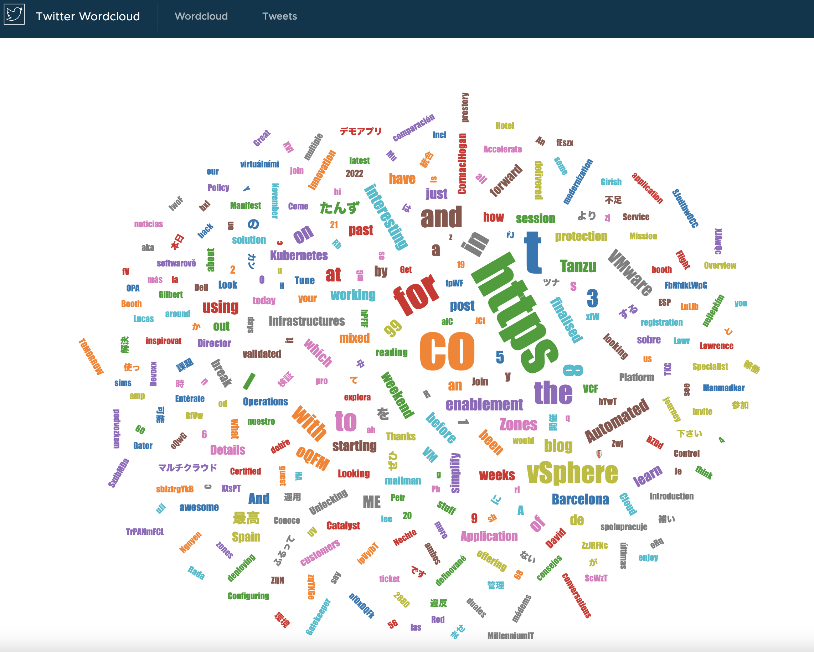
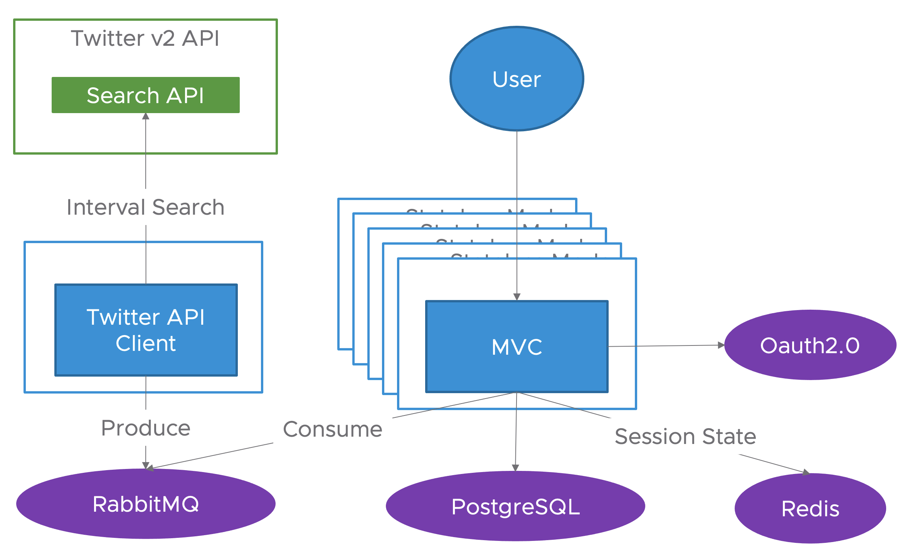

# Social Wordcloud generator in Spring Boot

Generate a wordcloud using Social API's such as Mastodon API / Twitter v2 API. Purposed for learning spring boot, and cloud native development technologies from [VMware Tanzu](https://tanzu.vmware.com/tanzu).



Supports 2 modes
- Standalone mode
- Microservices mode

The following technologies are used.

- Spring Boot
- [Spring Cloud Bindings](https://github.com/spring-cloud/spring-cloud-bindings)
- [Kuromoji](https://github.com/atilika/kuromoji)
- [D3 Cloud](https://github.com/jasondavies/d3-cloud)
- [Clarity UI](https://clarity.design/)
- [React-toastify](https://fkhadra.github.io/react-toastify/introduction)
- [Raw Mastodon API via WebSocket](https://docs.joinmastodon.org/methods/streaming/#websocket)

In addition, the following technologies are used for microservices mode
- [Spring Security OAuth2.0](https://spring.io/guides/tutorials/spring-boot-oauth2/)
- [Spring Cloud Sleuth](https://spring.io/projects/spring-cloud-sleuth)
- [RabbitMQ](https://www.rabbitmq.com/)
- [PostgreSQL](https://www.postgresql.org/)
- [Redis](https://redis.io/)
- [Wavefront](https://tanzu.vmware.com/observability)

The following is used but deprecated
- [Twitter API Client Library for Java](https://github.com/twitterdev/twitter-api-java-sdk)

# --- WIP ----

## Standalone mode

Standalone mode, supports running this application anywhere with only JVM installed.

### Architecture


Standalone mode runs in the following technologies

- Collect messages based on configured search hashtags, and interval
- Store tweets on local database
- Creates a view application based on data queried from the database
- Provides one time access password to log into "Tweets" page

> :warning: Standalone mode does not support scaling out the application
### Prerequisite

- Java 17 (or above)
- Create account in Mastodon
- Register an app (url is `https://<mstdn sever>/settings/applications`) with `read:statuses` and `read:notifications`
- Get access token of the app

> :warning: Currently only tested against https://mstdn.social/

### How to run

```
export MASTODON_TOKEN="..."
export MASTODON_HASHTAGS="#HASTHAG_TO_SEARCH"
git clone https://github.com/mhoshi-vm/social-wordcloud
cd social-wordcloud
./mvnw install && ./mvnw spring-boot:run -pl wordcloud
```

### Caution

Running in several instances (aka scale out) in standalone will lead to the following.

- No guarantee of all instances having the same data in database
- User login will not be consistent due to not having an external user database

## Microservices mode



In microservice mode we decouple the function in the following way

- MastodonAPIClient
    - To limit the amount of API calls against twitter, this is designed to only run in a single instance
    - Stores the messages not in a database but instead to a RabbitMQ Queue
- ModelViewController(MVC)
    - Supports scaling out
    - Consumes queue generated from the client
    - Updates/Reads from a single external Postgres database
    - User login performed by external OIDC identity provider
    - Store session cache on external Redis cache store

### Prerequisite

Additionally, to standalone mode prepare the following.

- RabbitMQ Cluster
- PostgreSQL Server
- Redis Cluster
- OAuth2.0 Endpoint

For observability also prepare the following
- Wavefront API token

### How to run

Prepare `application-twitterapiclient.properties` file.

```
## Mandatory
mastodon.token=MASTODON_TOKEN
mastodon.hashtags="#HASTHAG_TO_SEARCH"
spring.rabbitmq.host=RABBITMQ_HOST
spring.rabbitmq.password=RABBITMQ_PASSWORD
spring.rabbitmq.port=RABBITMQ_PORT
spring.rabbitmq.username=RABBITMQ_USERNAME

## Optional
management.metrics.export.wavefront.api-token=WAVEFRONT_TOKEN
management.metrics.export.wavefront.uri=WAVEFRONT_URI
management.metrics.export.wavefront.enabled=true
wavefront.tracing.enabled=true
wavefront.freemium-account=false
```

Run the mastodon-api client

```
./mvnw install && ./mvnw spring-boot:run -pl wordcloud -P mastodonapiclient
```

Prepare `application-modelviecontroller.properties`

```
## Mandatory
spring.rabbitmq.host=RABBITMQ_HOST
spring.rabbitmq.password=RABBITMQ_PASSWORD
spring.rabbitmq.port=RABBITMQ_PORT
spring.rabbitmq.username=RABBITMQ_USERNAME
spring.datasource.driver-class-name=org.postgresql.Driver
spring.datasource.password=POSTGRES_PASSWORD
spring.datasource.url=POSTGRES_URL
spring.datasource.username=POSTGRES_USERNAME
spring.r2dbc.url=POSTGRES_URI
spring.r2dbc.password=POSTGRES_PASSWORD
spring.r2dbc.username=POSTGRES_USERNAME
spring.security.oauth2.client.registration.{name}.client-id=client-id
spring.security.oauth2.client.registration.{name}.client-secret	=client-secret
spring.security.oauth2.client.registration.{name}.provider=provider
spring.security.oauth2.client.registration.{name}.client-name=client-name
spring.security.oauth2.client.registration.{name}.client-authentication-method=client-authmode
spring.security.oauth2.client.registration.{name}.authorization-grant-type=grant-type
spring.security.oauth2.client.registration.{name}.redirect-uri=redirect-uri
spring.security.oauth2.client.registration.{name}.scope=scope
spring.security.oauth2.client.provider.{provider}.issuer-uri=issuer-uri
spring.security.oauth2.client.provider.{provider}.authorization-uri=autorization-uri
spring.security.oauth2.client.provider.{provider}.token-uri=token-uri
spring.security.oauth2.client.provider.{provider}.user-info-uri=user-info-uri
spring.security.oauth2.client.provider.{provider}.user-info-authentication-method=user-info-authentication-method
spring.security.oauth2.client.provider.{provider}.jwk-set-uri=jwk-set-uri
spring.security.oauth2.client.provider.{provider}.user-name-attribute=user-name-attribute
spring.redis.client-name={client-name}
spring.redis.cluster.max-redirects={cluster.max-redirects}
spring.redis.cluster.nodes={cluster.nodes}
spring.redis.database={database}
spring.redis.host={host}
spring.redis.password={password}
spring.redis.port={port}
spring.redis.sentinel.master={sentinel.master}
spring.redis.sentinel.nodes={sentinel.nodes}
spring.redis.ssl={ssl}
spring.redis.url={url}


## Optional
management.metrics.export.wavefront.api-token=WAVEFRONT_TOKEN
management.metrics.export.wavefront.uri=WAVEFRONT_URI
management.metrics.export.wavefront.enabled=true
wavefront.tracing.enabled=true
wavefront.freemium-account=false
```

Run the modelviewcontroller app.

```
./mvnw install && ./mvnw spring-boot:run -pl wordcloud -P modelviewcontroller
```

### Yikes! this is difficult ...

Don't worry. We have an easier way, the [TAP way](TAP.md)


# Experimental (Greenplum Support)

Added [Greenplum support](GP.md)